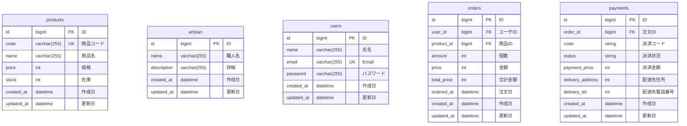

```mermaid
erDiagram
    products {
        id bigint PK "ID"
        code varchar(255) UK "商品コード"
        name varchar(255) "商品名"
        price int "価格"
        stock int "在庫"
        created_at datetime "作成日"
        updated_at datetime "更新日"
    }
    artisan {
        id bigint PK "ID"
        name varchar(255) "職人名"
        description varchar(255) "詳細"
        created_at datetime "作成日"
        updated_at datetime "更新日"
    }
    users {
        id bigint PK "ID"
        name varchar(255) "氏名"
        email varchar(255) UK "Email"
        password varchar(255) "パスワード"
        created_at datetime "作成日"
        updated_at datetime "更新日"
    }
    orders {
        id bigint PK "ID"
        user_id bigint FK "ユーザID"
        product_id bigint FK "商品ID"
        amount int "個数"
        price int "金額"
        total_price int "合計金額"
        ordered_at datetime "注文日"
        created_at datetime "作成日"
        updated_at datetime "更新日"
    }
    payments {
        id bigint PK "ID"
        order_id bigint FK "注文ID"
        code string "決済コード"
        status string "決済状況"
        payment_price int "決済金額"
        delivery_address int "配達先住所"
        delivery_tel int "配達先電話番号"
        created_at datetime "作成日"
        updated_at datetime "更新日"
    }
```